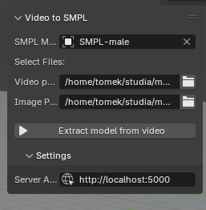
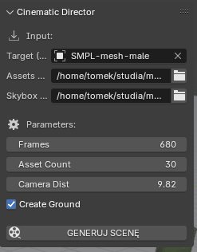

# Video to Blender scene


## About this project

This project converts a source video into a Blender scene by extracting motion and appearance 

### Flask server
- Provides a small HTTP API to accept videos (or use local files), run the offline processing pipeline, and serve resulting motion + texture bundles to the Blender client.
- Orchestrates model inference, queues jobs, and returns compact results (motion sequences, texture bitmaps) consumed by the addon.


### Two-model pipeline
1. Motion / pose model (WHAM)
    - Extracts per-frame human pose and motion parameters from the input video.
    - Produces a canonical motion representation (SMPL parameters) suitable for animation import.
2. Appearance / texture model (SMPLitex)
    - Synthesizes per-frame or UV textures for the reconstructed body/mesh.
    - Produces texture maps aligned to the mesh UVs and optional per-frame albedo/normal maps.
    - a local Stable Diffusion installation performs inpainting of the texture to refine the results.

These two outputs (motion + texture) are packaged by the server and fetched by the Blender addon client, which loads them into the scene and drives the SMPL model.


### Workflow summary
- Upload video or point server to example.mp4 → Flask schedules job → motion model + texture model run → Stable Diffusion inpainting refines textures → server returns bundle → Blender addon loads motion and textures into the scene.

> [!IMPORTANT]  
> WHAM returns world space and camera space transforms for the SMPL model bones, but not the global camera position! The camera is reconstructed from these two factors, but the POV inside blender isn't perfect, due to independent generation of the two transforms by WHAM. But looks good enough.

## Installation

Setup is very fragile due to very specific library verisons used by WHAM and SMPLitex. It's impossible to bundle everything inside the app, therefore a flask server reaches into two different virtual environments prepared for these models (and a separate installation of Stable Diffusion started with `--api` flag, with SMPLitex finetuned inpainting model). Roughly:

1. Create a conda environment for WHAM, clone the repo and install the dependencies. Don't try with a regular venv, as you will run into hard to solve dependency issues. You also need to downlaod the required models
2. Create a conda environment for SMPLitex, install dependencies, downlaod the required models
3. Download Blender 4.4, install the addon. The easiest way is to create a .zip file of the `blender_addon` directory and just dragging onto the window.

## Addon interface

Point the addon to desired video path and a reference photo (doesn't have to do anyhting with the video, but that's the idea)




Additional random scene generator, using assets and environment file.




Project structure:
```
.
├── app.py - flask server, run with "flask run" in terminal
├── blender_addon
│   ├── client.py - connects to server and receives motion+texture
│   ├── __init__.py
│   ├── processing.py - loads results into blender project
│   └── UI.py - addon UI in toolbar (N key)
├── config.py - modify this file with correct WHAM and SMPLitex installation paths!!!
├── example.mp4
├── example.png
├── load_wham_standalone.py - can be used as a script in Blender
├── projekt.blend - example scene
├── README.md
├── requirements.txt - requirements for flask server (needs joblib and torch to convert WHAM results)
├── test_client.py - same as addon client, but outside of blender
```
